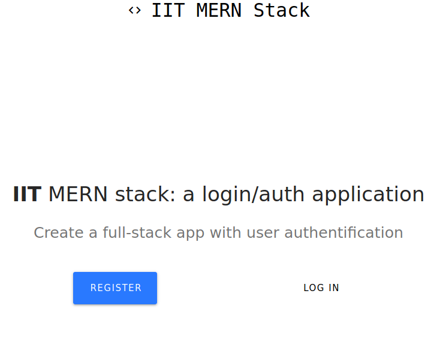
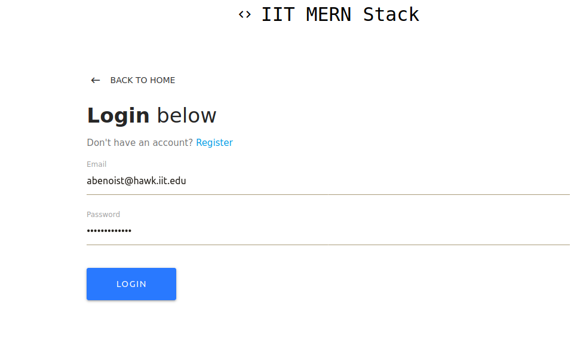
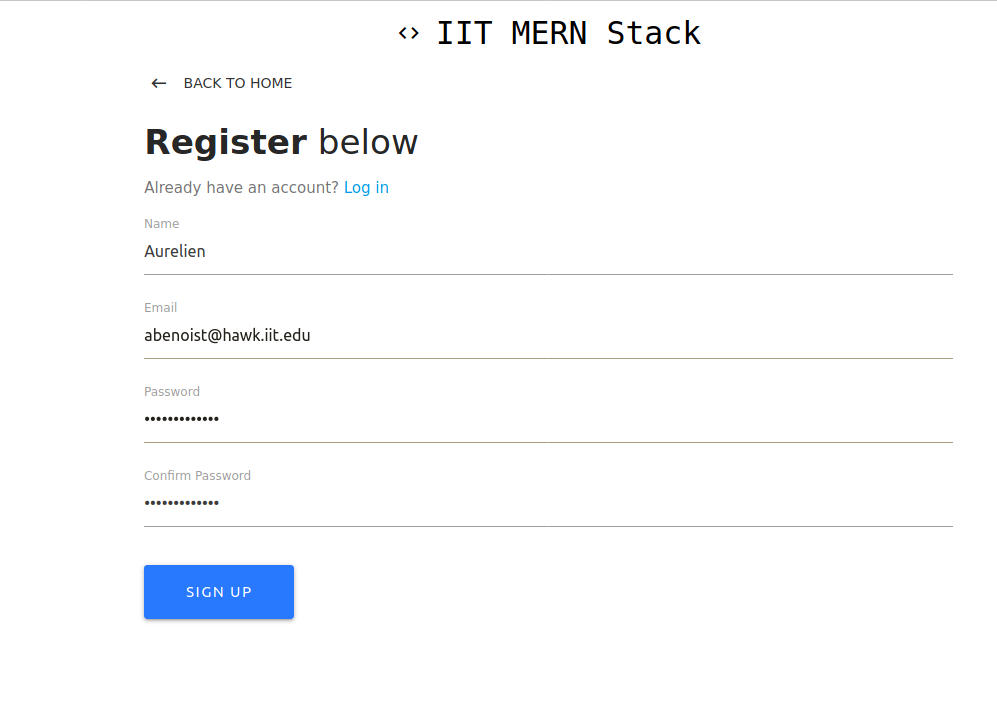

# MERN Stack: login page

## Setup

To build a MERN stack from scratch you will need to:
* install nodejs and npm on the server;
* install MongoDB: ``` sudo apt-get install -y mongodb-org ```;
* init the project: ``` npm init```;
* install all dependencies: ``` npm i bcryptjs body-parser concurrently express is-empty jsonwebtoken mongoose passport passport-jwt validator```;
* Setting up your database in MongoDB.

## Template

You can use this template, modify it, adapt it to your application. I let some comments in the different files of the projects.

### Skeleton of the MERN Stack

The client floder contains the front-end of the application, you can run:
```shell
npm i -g create-react-app
 create-react-app .
```
to create a react project (it's easier than doing it from scratch).

The config folder contains the config files for our application (key for the connection to MongoDB).

The validation folder contains the files to validate a login or a register (*i.e.* check if a field is empty or not, check the format, ...).

The 'server.js' file is to lauch the server (nodejs).

I'm using Redux for state management.

### Result

Welcome Page:


Login Page:


Register Page:



# References

1: https://docs.mongodb.com/manual/tutorial/install-mongodb-on-ubuntu/
2: https://medium.com/swlh/how-to-create-your-first-mern-mongodb-express-js-react-js-and-node-js-stack-7e8b20463e66
3: https://openclassrooms.com/fr/courses/4664381-realisez-une-application-web-avec-react-js
4: https://openclassrooms.com/fr/courses/6390246-passez-au-full-stack-avec-node-js-express-et-mongodb/6466298-creez-une-route-get
5: https://www.youtube.com/watch?time_continue=1&v=93p3LxR9xfM&feature=emb_logo
